# Welcome to Bounty Hacker: A TryHackMe.com Walkthrough
[Bounty Hacker](https://tryhackme.com/room/cowboyhacker)

This is my first published walkthrough. I hope it helps you learn and you enjoy it.

This room is considered easy. It can be completed in about 20 minutes.

## Tools used
* Kali Linux
* openvpn
* nmap
* ftp, ssh, cat, cd, ls, curl, find, sudo, tar 
* hydra
* GTFOBins.github.io

Question 1 - no answer

Question 2 - no answer

If you need to brush up on any of these tools/skills, use
> root@kali%> man nmap

for example, to see the nmap manual

## Connecting
I used the provided VPN information to connect Kali to the provided network.

## Reconnaissance
None needed

## Scanning
I used nmap to find available ports on the target machine. This revealed ports 21, 22, and 80.

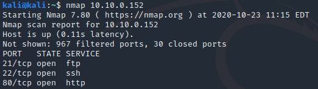

## Gaining Access
#### Exploitation
I curl/ed to see what was on port 80. It was a plain page with no remarkable items.

I anonimously ftp/ed in and found two files locks.txt and task.txt. I used get in ftp to download these files. Once downloaded, I cat/ed both files. I used the task.txt file to find the user (Question 3), and the locks.txt was a password list.

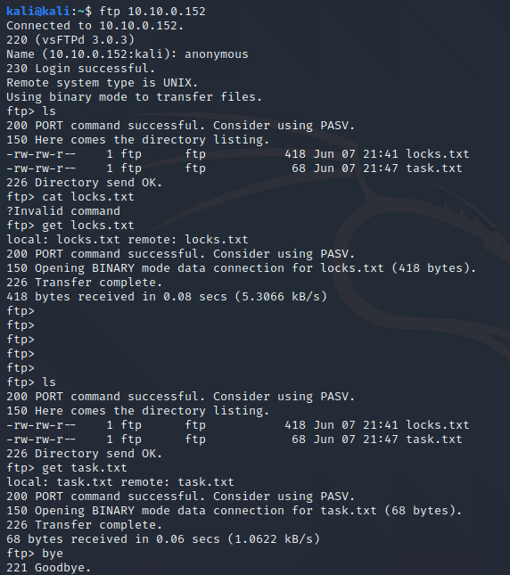

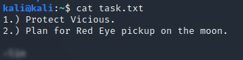

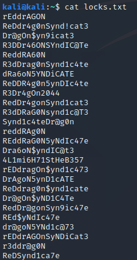

Having a password list, I used hydra to brute force the password for the user discovered above. (Question 4)

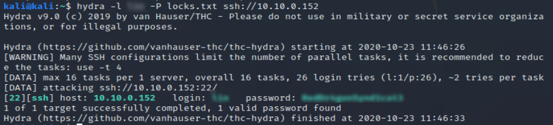

I used the password hydra found to ssh in (Question 5). Once in, I used ls to look in all the directories in the user's home directory. I found the user.txt file in the Desktop directory. I cat/ed it to reveal the first flag (Question 6).

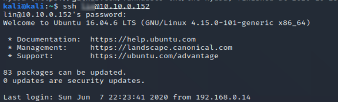

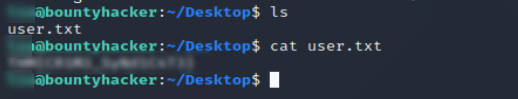

#### Privilege Escalation 
I used find to try to find root.txt to no avail. I assumed the file would be inaccessible to the current user. In order to find out what I can run, I used sudo -l. I found that the tar command was available to the user and would run as root. After a few tries to use tar to privescalate, I went to GTFOBins.github.io too find a known exploit for tar. 

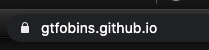

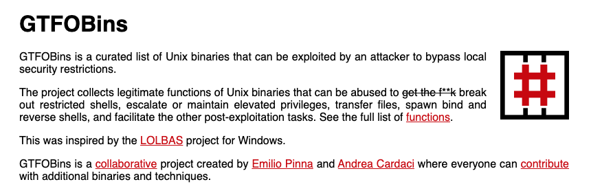

I found the correct target and ran it. It gave me a bash as root. I ls/ed all the directories again and found root.txt root directory in the root of the drive. (Question 7)

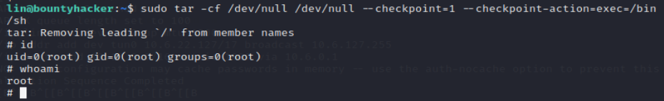

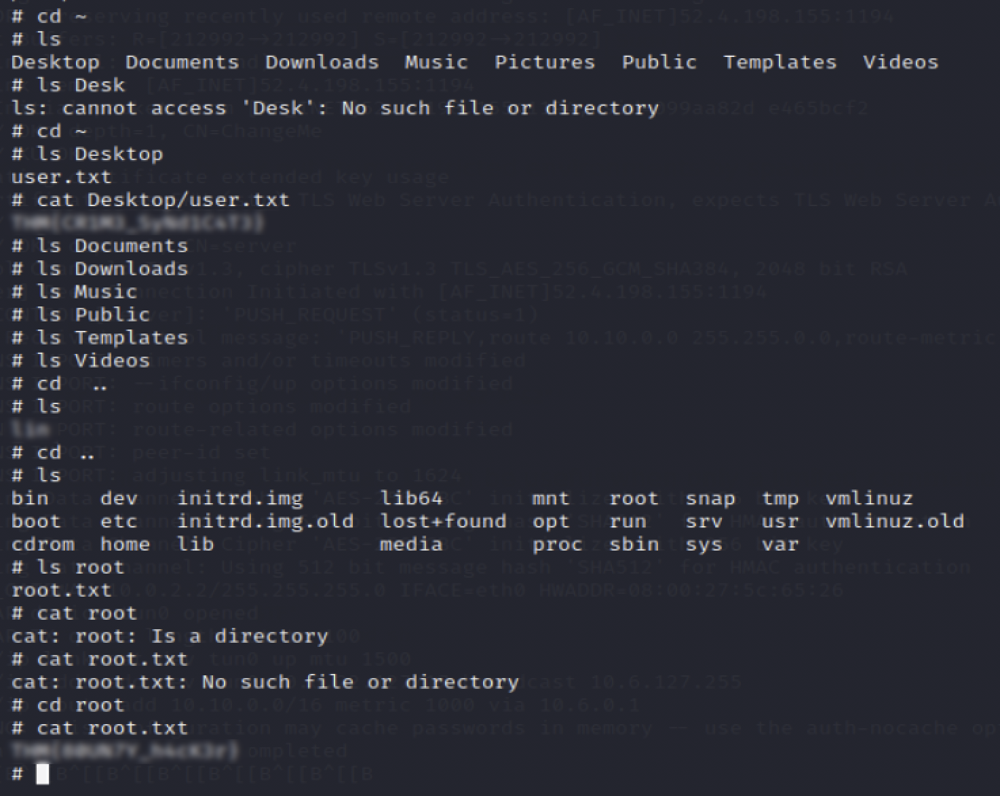

## Maintaining Access 
Not needed

## Clearing Tracks 
Not needed
